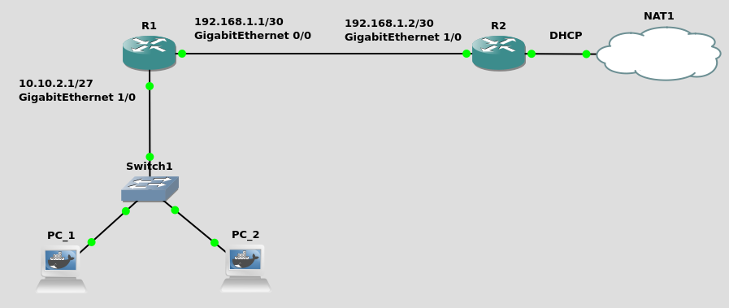
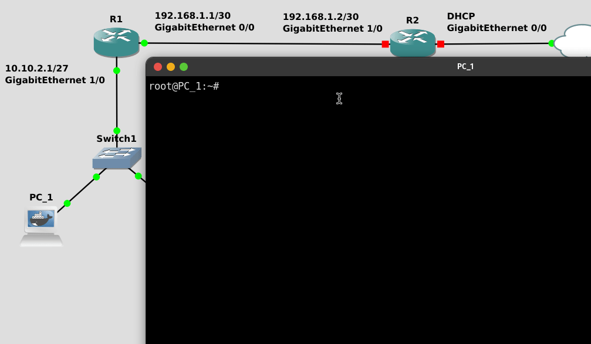

# Setting up a simple home network



- [Router R1](#router-r1)
  * [Assigning an IP address to interface gigabitEthernet 1/0](#assigning-an-ip-address-to-interface-gigabitethernet-1-0)
  * [Setting up a DHCP pool](#setting-up-a-dhcp-pool)
  * [Configure the second interface of the router](#configure-the-second-interface-of-the-router)
  * [Setting up RIP](#setting-up-rip)
  * [Setting up the default route](#setting-up-the-default-route)
- [Router R2](#router-r2)
  * [Assigning an IP address to interface gigabitEthernet 1/0](#assigning-an-ip-address-to-interface-gigabitethernet-1-0-1)
  * [Setting up RIP](#setting-up-rip-1)
  * [Getting an IP address from the ISP](#getting-an-ip-address-from-the-isp)
  * [Setting up NAT](#setting-up-nat)
  * [Saving the configuration of the router.](#saving-the-configuration-of-the-router)

## Router R1

### Assigning an IP address to interface gigabitEthernet 1/0

First of all, we need to configure interface gigabitEthernet 1/0 or router R1, which works as the default gateway for all devices connected to the private network (`10.10.2.0/27`). Mask `255.255.255.224 = 27` allows as many as 30 different devices to be connected to the network.

```
config term
interface gigabitEthernet 1/0
ip address 10.10.2.1 255.255.255.224
no shutdown
end
```

Next, we'll enable DHCP, which will take care of handing out IP addresses. As default DNS servers, I decided to use `8.8.8.8` and `4.4.4.4` - Google's DNS servers.
### Setting up a DHCP pool


```
config term
ip dhcp pool home
network 10.10.2.0 255.255.255.224
default-router 10.10.2.1
dns-server 8.8.8.8 4.4.4.4
end
```

At this point, both PC_1 and PC_2 should be assigned an IP address and able to reach as far as `10.10.2.1` (router R1).



### Configure the second interface of the router

Now we can move on to configuring the other interface of router R1. This interface will be assigned a static IP address of `192.168.1.1`. The mask is set to `255.255.255.252` since there are only two hosts needed within this subnet.

```
config term
interface gigabitEthernet 0/0
ip address 192.168.1.1 255.255.255.252
no shutdown
end
```

### Setting up RIP

In order to reach `192.168.1.0/30` from `10.10.2.0/27`, we'll set up RIPv2 which will take care of dynamic routing.

```
config term
router rip
version 2
network 10.10.2.0
network 192.168.1.0
end
```

### Setting up the default route

Lastly, we need to set up a default route, so the router knows where to send packets that are targeted to either of the subnets. This is used, typically, when reaching public servers outside of the local network. 

```
config term
ip route 0.0.0.0 0.0.0.0 192.168.1.2
end
```

### Saving the configuration of the router.

Before moving on to router R2, we need to save our configuration.

```
copy running-config startup-config
```

---

## Router R2

### Assigning an IP address to interface gigabitEthernet 1/0


```
config term
interface gigabitEthernet 1/0
ip address 192.168.1.2 255.255.255.252
no shutdown
end
```
### Setting up RIP


```
config term
router rip
version 2
network 192.168.1.0
```

### Getting an IP address from the ISP

```
config term
interface gigabitEthernet 0/0
ip address dhcp
no shutdown
end
```

### Setting up NAT

```
config term
access-list 100 permit ip 192.168.1.0 0.0.0.3 any
access-list 100 permit ip 10.10.2.0 0.0.0.31 any
interface gigabitEthernet 1/0
ip nat inside
interface gigabitEthernet 0/0
ip nat outside
ip nat inside source list 100 interface GigabitEthernet0/0 overload
end
```

### Saving the configuration of the router.

```
copy running-config startup-config
```