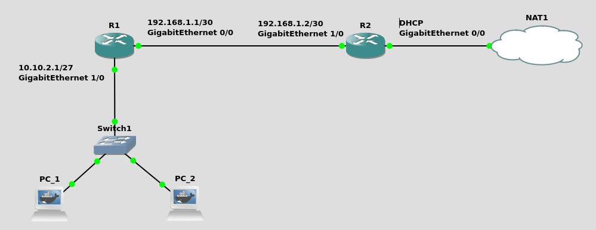

# Setting up a simple home network

This README goes over a set-up and debugging of a simple home network which is eventually connected to the internet using NAT. The network was built in [gns3](https://www.gns3.com/) using Cisco routers 7200.



- [Router R1](#router-r1)
  * [Assigning an IP address to interface gigabitEthernet 1/0](#assigning-an-ip-address-to-interface-gigabitethernet-1-0)
  * [Setting up a DHCP pool](#setting-up-a-dhcp-pool)
  * [Configure the second interface of the router](#configure-the-second-interface-of-the-router)
  * [Setting up RIP](#setting-up-rip)
  * [Saving the configuration of the router.](#saving-the-configuration-of-the-router)
- [Router R2](#router-r2)
  * [Assigning an IP address to interface gigabitEthernet 1/0](#assigning-an-ip-address-to-interface-gigabitethernet-1-0-1)
  * [Setting up RIP](#setting-up-rip-1)
  * [Getting an IP address from the ISP](#getting-an-ip-address-from-the-isp)
  * [Setting up NAT](#setting-up-nat)
  * [Saving the configuration of the router.](#saving-the-configuration-of-the-router-1)
- [Debugging](#debugging)
  * [Setting up a default route of R1](#setting-up-a-default-route-of-r1)

## Router R1

### Assigning an IP address to interface gigabitEthernet 1/0

First of all, we need to configure interface gigabitEthernet 1/0 or router R1, which works as a default gateway for all devices connected to the private network (`10.10.2.0/27`). Mask `255.255.255.224 = 27` allows as many as 30 different hosts to be connected to the network.

```
config term
interface gigabitEthernet 1/0
ip address 10.10.2.1 255.255.255.224
no shutdown
end
```

### Setting up a DHCP pool

Next, we'll enable DHCP, which will take care of handing out IP addresses to the hosts. As default DNS servers, I decided to use `8.8.8.8` and `4.4.4.4` - Google's DNS servers. The name of the pool is 'home'.

```
config term
ip dhcp pool home
network 10.10.2.0 255.255.255.224
default-router 10.10.2.1
dns-server 8.8.8.8 4.4.4.4
end
```

At this point, both PC_1 and PC_2 should be assigned an IP address and able to reach as far as `10.10.2.1` (router R1).


### Configure the second interface of the router

Now we can move on to configuring the other interface of router R1. This interface will be assigned a static IP address of `192.168.1.1`. The mask is set to `255.255.255.252` since there are only two hosts needed within this subnet.

```
config term
interface gigabitEthernet 0/0
ip address 192.168.1.1 255.255.255.252
no shutdown
end
```

### Setting up RIP

In order to reach `192.168.1.0/30` from `10.10.2.0/27`, we'll set up RIPv2 which will take care of dynamic routing.

```
config term
router rip
version 2
network 10.10.2.0
network 192.168.1.0
end
```
### Saving the configuration of the router.

Before moving on to router R2, we need to save our configuration.

```
copy running-config startup-config
```

---

## Router R2

### Assigning an IP address to interface gigabitEthernet 1/0

To start off, we will set up interface gigabitEthernet 1/0, so we can reach router R2 from `10.10.2.0/27`.

```
config term
interface gigabitEthernet 1/0
ip address 192.168.1.2 255.255.255.252
no shutdown
end
```

As of now, router R2 is reachable from subnet `10.10.2.0/27`. However, since there is now reverse route set up yet. Pings messages will be received but unanswered. This could be verified using WireShark.


### Setting up RIP

As soon, as RIP is enabled on router R2 as well, ping will come through.

```
config term
router rip
version 2
network 192.168.1.0
```


### Getting an IP address from the ISP

As the next step, we will set gigabitEthernet 0/0 to be assigned a dynamic IP address. This is meant to simulate an IP address given by an ISP.

```
config term
interface gigabitEthernet 0/0
ip address dhcp
no shutdown
end
```

### Setting up NAT

The very last step is to connect the private network to the internet. In order to do so, we need to configure NAT (network address translation) on router R2. We need to include both subnets into the configuration.

```
config term
access-list 100 permit ip 192.168.1.0 0.0.0.3 any
access-list 100 permit ip 10.10.2.0 0.0.0.31 any
interface gigabitEthernet 1/0
ip nat inside
interface gigabitEthernet 0/0
ip nat outside
ip nat inside source list 100 interface GigabitEthernet0/0 overload
end
```

### Saving the configuration of the router.

Lastly, we can save the configuration of router R2.

```
copy running-config startup-config
```

---

## Debugging

At this point, we should be able to ping any public server such as `google.com` or `stackoverflow.com`. However, we can see that our ping is not coming through. An indication of what the issue might be is that `10.10.2.1` is returning 'Host Unreachable'. This is because the router doesn't know where to send the packets. It only knows of subnets `10.10.2.0/27` and `192.168.0.1/30`. Therefore, we need to set up a default gateway, so it knows where to send the packets which are not being sent to either of the subnets.

### Setting up a default route of R1

```
config term
ip route 0.0.0.0 0.0.0.0 192.168.1.2
end
```